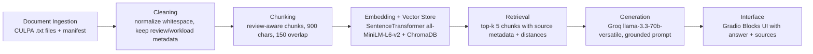

# Project 1 Planning: The Unofficial Guide

## Domain

Columbia University CS course and professor reviews, focused on workload, exam style, teaching quality, and practical course-planning advice for COMS courses. Official course pages list topics and prerequisites, but they do not tell students whether lectures are useful, exams are fair, assignments are time-consuming, or one professor's section feels very different from another. I used public CULPA reviews because that information exists, but it is spread across separate course pages and is hard to compare quickly during registration.

## Documents

| # | Source | Description | URL or location |
|---|--------|-------------|-----------------|
| 1 | CULPA COMS W1004 Intro to Computer Science in Java | Introductory Java programming reviews, workload, professor notes | `documents/coms-w1004-intro-java.txt`; https://culpa.info/course/3807 |
| 2 | CULPA COMS W3134 Data Structures in Java | Core data structures reviews and professor/workload comparisons | `documents/coms-w3134-data-structures.txt`; https://culpa.info/course/4 |
| 3 | CULPA COMS W3157 Advanced Programming | C/C++ and systems-programming workload, labs, exams, professor reviews | `documents/coms-w3157-advanced-programming.txt`; https://culpa.info/course/4758 |
| 4 | CULPA COMS W3203 Discrete Mathematics | Proofs/discrete math reviews, Tony Dear-heavy exam/curve evidence, and other professor section notes | `documents/coms-w3203-discrete-math.txt`; https://culpa.info/course/397 |
| 5 | CULPA COMS W4111 Introduction to Databases | SQL/database systems reviews, project, homework, exam structure | `documents/coms-w4111-databases.txt`; https://culpa.info/course/664 |
| 6 | CULPA COMS W4115 Programming Languages and Translators | PLT/compiler project reviews, OCaml, group project workload | `documents/coms-w4115-plt.txt`; https://culpa.info/course/3105 |
| 7 | CULPA COMS W4156 Advanced Software Engineering | Advanced software engineering reviews, project-heavy workload and professor notes | `documents/coms-w4156-advanced-software-engineering.txt`; https://culpa.info/course/1616 |
| 8 | CULPA COMS W4701 Artificial Intelligence | AI reviews, including Ansaf Salleb-Aouissi homework/exam structure and other professor comparisons | `documents/coms-w4701-artificial-intelligence.txt`; https://culpa.info/course/26 |
| 9 | CULPA COMS W4771 Machine Learning | Machine learning reviews, theory vs applied work, exams, professor comparisons | `documents/coms-w4771-machine-learning.txt`; https://culpa.info/course/1921 |
| 10 | CULPA COMS E6111 Advanced Database Systems | Graduate database systems reviews and project/workload notes | `documents/coms-e6111-advanced-database-systems.txt`; https://culpa.info/course/4956 |

The documents are review-heavy. Each file begins with course/source metadata and a professor list, then contains individual review records with review ID, submission date, course, professor, rating, review text, and workload notes. Most facts are concentrated inside one review or workload note, but important themes repeat across multiple reviews in the same course.

## Chunking Strategy

**Chunk size:** 900 characters maximum.

**Overlap:** 150 characters when a single review must be split across multiple chunks.

**Reasoning:** The CULPA files are not long articles. They are groups of short-to-medium review records. I wanted each chunk to keep a review's professor, course, rating, review text, and workload notes together whenever possible. A 900-character limit is big enough for one concise review plus metadata, but still small enough to avoid mixing unrelated opinions about different professors. Longer reviews, especially in Databases, PLT, Advanced Programming, and Machine Learning, get split with overlap so details like project structure or exam weighting are not lost at a boundary.

Bad chunks for this corpus would be tiny fragments like "3 exams" without the course/professor metadata, or giant chunks that combine Tony Dear discrete math exam complaints with Ansaf workload notes. The loader will keep source filename, course code/name, professor name when available, review ID, and chunk position in metadata so retrieval and citations can stay specific.

## Retrieval Approach

**Embedding model:** `all-MiniLM-L6-v2` via `sentence-transformers`, loaded locally with `SentenceTransformer("all-MiniLM-L6-v2")`.

**Top-k:** Start with top-k `5`.

**Production tradeoff reflection:** `all-MiniLM-L6-v2` made sense for this project because it is free, local, fast, and works well enough for short English review chunks. If I were building a real advising tool, I would test stronger embeddings on a labeled eval set. This corpus repeats the same words a lot: "exams," "homework," "project," and professor names show up across many courses. I would compare retrieval quality against API cost, latency, context length, privacy concerns around student reviews, and multilingual support if the source set expanded. I would also test hybrid search because exact strings like `COMS W4115`, `Jae Lee`, and `OCaml` matter here.

**Implementation update:** Early retrieval testing found a real problem: a W3157 query could rank a W4156 chunk first because both chunks used words like "advanced," "workload," and "labs." The retriever still uses semantic Chroma search, but if the query includes a course code such as `COMS W3157`, it pulls a wider candidate set and moves exact course-code matches to the top before returning the final 5 chunks. I added the same idea for professor names during evaluation because W4701 has several professor versions with different homework and exam structures.

## Evaluation Plan

| # | Question | Expected answer |
|---|----------|-----------------|
| 1 | What do COMS W3203 reviewers say about Tony Dear's exams and curve? | Reviews say Dear's exams can be difficult or have a gap from class examples/homework, but several mention a generous/significant curve or final grade curve; one review says the final average was around 70 and another says the class curves to around B+/compensates for rigor. |
| 2 | What workload pattern does COMS W3157 Advanced Programming with Jae Lee have? | Reviews describe a lab-heavy C/systems class where later labs take significant time, exams are tied closely to lectures, labs, and practice exams, and at least one reviewer reports about 7 hours a week plus exam cramming. |
| 3 | What practical project do COMS W4111 Databases reviews describe? | Reviews describe a multi-part database project involving schema design, SQL/PostgreSQL-style database work, populating data, and building a simple web app that uses the database; some reviewers say it is useful practical experience. |
| 4 | What do COMS W4115 PLT reviewers say about the major project and OCaml? | Reviews say students learn/use OCaml and complete a semester-long group compiler/language project; the project is large/monstrous but manageable if started early and done incrementally with a good group. |
| 5 | How do COMS W4701 AI reviewers describe Ansaf Salleb-Aouissi's homework and exams? | Ansaf reviews mention 5 coding assignments and 5 conceptual assignments, the lowest coding and conceptual grades being dropped in one review, and two exams or midterm-style tests; another Ansaf review criticizes the coding grading script. |

## Anticipated Challenges

1. Reviews are subjective and sometimes conflict. For example, one course can have both "easy A" and "hardest class" reviews depending on professor, semester, and student priorities. The system should answer with qualifiers like "reviewers say" and cite the source chunks, not collapse all opinions into a single authoritative verdict.
2. Course codes, professor names, and generic workload words overlap heavily across documents. Queries like "how hard are exams?" can retrieve the wrong course unless chunks preserve course/professor metadata and retrieval keeps enough top-k results for the generator to compare sources.
3. Some important facts are in workload notes rather than review text. The ingestion pipeline must keep both fields together; otherwise the answer might cite a review's opinion while missing concrete assignment/exam counts.
4. The corpus is real public review text, so it contains profanity and informal phrasing. Cleaning should remove boilerplate and HTML artifacts, but it should not sanitize away meaning or make the source look more official than it is.

## Architecture

## AI Tool Plan

**Ingestion and chunking:** I gave Codex the document list, chunking strategy, and existing `documents/` folder. Codex produced the loader/chunker, cleaned document outputs, and `data/chunks.jsonl`. I reviewed the cleaned document preview, random chunks, chunk count, and metadata coverage.

**Embedding and retrieval:** I gave Codex the retrieval approach and eval questions. Codex implemented SentenceTransformer + Chroma retrieval and printed distances/previews. I reviewed the first retrieval results, kept the course-code reranking fix after the W3157/W4156 failure, and later kept the professor-name reranking for Ansaf-specific W4701 questions.

**Generation, interface, and evaluation:** I gave Codex the grounding requirements, Groq model choice, and README rubric. Codex implemented the Groq generation wrapper, source formatting, Gradio UI, and eval runner. I reviewed the live Groq eval output and kept Q5 as partially accurate because the retrieved context still mixes stronger and weaker W4701 evidence.
